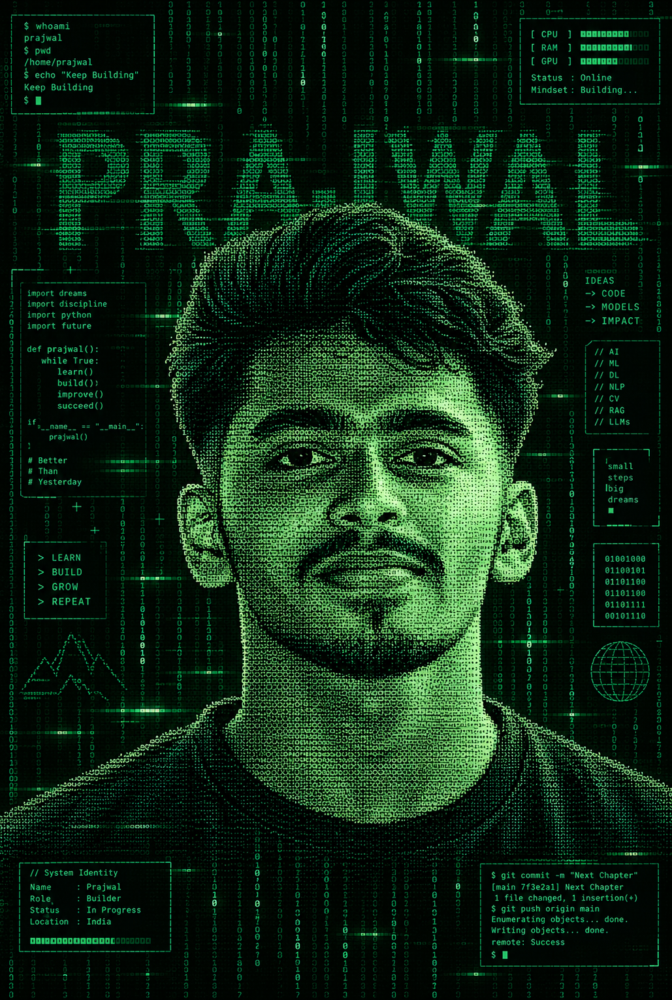

<h1>Hey there, I'm Prajwal 👋</h1>

  
  
  
  

  
  
  

 

---

<table align="center" width="100%">
<tr>
<td width="65%" valign="top">

## 👨‍💻 About Me

I'm **Prajwal**, an AI & Machine Learning Engineer focused on building End-to-End Intelligent Pipelines, Production AI Systems, and Scalable Architectures.

I enjoy taking an idea from **concept → architecture → development → deployment → production**.

- 🔄 End-to-End AI & ML Pipeline Building & Deployment
- 🤖 Generative AI, LLMs & RAG Architectures
- 🧠 Deep Learning, Computer Vision & NLP Solutions
- ⚡ High-Performance APIs & Microservices (FastAPI)
- 🐳 Containerization, Docker & Cloud Deployment
- 💻 Scalable Distributed Systems & Backend Architecture

> **Build things. Break things. Learn things. Ship things.**

</td>
<td width="38%" align="center" valign="middle">

  

 

</td>
</tr>
</table>

  

## 🐍 Contribution Snake

<picture>
  <source media="(prefers-color-scheme: dark)" srcset="https://raw.githubusercontent.com/Prajwal-ishwar-naik/Prajwal-ishwar-naik/output/github-contribution-grid-snake-dark.svg">
  <source media="(prefers-color-scheme: light)" srcset="https://raw.githubusercontent.com/Prajwal-ishwar-naik/Prajwal-ishwar-naik/output/github-contribution-grid-snake.svg">
  
</picture>

 

 
<b>© Prajwal</b> · AI & Machine Learning Pipeline Engineer

